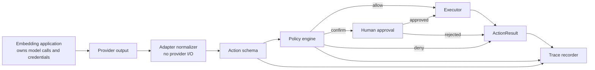

# Architecture

ActionAnything separates provider-shaped model output from deterministic action
execution. The embedding application makes any model calls; an adapter only
normalizes a supported provider response into an `Action`. The runtime then
decides whether that action is allowed to reach an executor. ActionAnything
does not own model credentials, prompts, provider safety acknowledgements, or
the application's business policy.

## Design principles

### Model agnostic

Providers are represented by adapters that normalize documented, supported
output into the action schema. An adapter is not a model client: it must not
make provider requests, own API keys, send screenshots back to a model, or
approve a provider safety check. The policy and executor layers must not depend
on a provider SDK. The application decides if, when, and how provider calls are
made.

### Safe by construction

Safety checks live in regular Python code, not only in a prompt. A model can
request an action, but it cannot override a deny decision or approve itself.
These checks do not establish the semantic safety of a page, model request, or
business operation; applications still need their own policy and human review
for consequential work.

### Dry-run first

The CLI uses `DryRunExecutor` unless a user explicitly passes `--execute`.
This makes plans inspectable before they touch a browser. Dry-run does not
bypass policy: navigation still needs an explicit allowlist, and the real
Playwright executor additionally requires one before it can start.

### Local evidence, not a security boundary

Every evaluated action can be written to JSONL. Default events retain only a
small structural/numeric subset; arbitrary strings, identifiers, metadata,
policy text, errors, and artifact paths are redacted unless the user explicitly
opts into an unsafe local test trace. JSONL append behavior does not make traces
tamper-proof, safe to publish, or a substitute for secret management.

## Core modules

| Module | Responsibility |
|---|---|
| `actions.py` | Stable action, risk, and result schemas |
| `adapters/` | Provider-output normalizers; no model calls or credentials |
| `policy.py` | Composable allow, confirm, and deny decisions |
| `executors.py` | Dry-run and optional Playwright execution |
| `runtime.py` | Policy-to-confirmation-to-execution orchestration |
| `recorder.py` | Redacted JSONL traces and trace loading |
| `cli.py` | Portable plans, trace inspection, and replay |

## Extending the project

### Add a model adapter

Translate a provider response into `Action.from_dict(...)`. Keep authentication,
streaming, retries, model requests, safety acknowledgement, and provider
session state in the embedding application rather than the adapter. Store only
useful, non-sensitive provenance under `Action.metadata`; reject unsupported
provider fields instead of silently approximating them.

### Add an executor

Implement `Executor.execute(action)` and expose `is_dry_run`. Executors should
reject unsupported actions, avoid hidden retries, and return JSON-compatible
metadata rather than provider objects.

### Add a policy

Implement `Policy.evaluate(action)`. Return `None` when the policy does not
apply. `PolicyEngine` gives deny decisions precedence over confirmation, and
confirmation precedence over allow.

The standard domain policy accepts explicit ASCII hostnames only. When an
application uses an internationalized domain, it must configure the intended
Punycode A-label rather than relying on ActionAnything to convert a Unicode
host spelling. This makes the comparison deliberately narrower than browser
URL canonicalization; it is not a claim to solve homograph or DNS risks.

## Near-term roadmap

- Additional adapters for documented computer-use model outputs.
- JSON Schema export for actions and policy outcomes.
- Screenshot evidence associated with each trace step.
- Sandboxed remote executors and explicit resource limits.
- BrowserGym/WebArena-compatible evaluation runners.
- Signed policy bundles for shared deployments.
