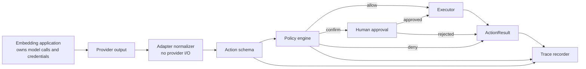

# Architecture

ActionAnything separates provider-shaped model output from deterministic action
execution. The embedding application makes any model calls; an adapter only
normalizes a supported provider response into an `Action`. The runtime then
decides whether that action is allowed to reach an executor. ActionAnything
does not own model credentials, prompts, provider safety acknowledgements, or
the application's business policy.

## Design principles

### Model agnostic

Providers are represented by adapters that normalize documented, supported
output into the action schema. An adapter is not a model client: it must not
make provider requests, own API keys, send screenshots back to a model, or
approve a provider safety check. The policy and executor layers must not depend
on a provider SDK. The application decides if, when, and how provider calls are
made.

### Safe by construction

Safety checks live in regular Python code, not only in a prompt. A model can
request an action, but it cannot override a deny decision or approve itself.
These checks do not establish the semantic safety of a page, model request, or
business operation; applications still need their own policy and human review
for consequential work.

At the base, unoverridden runtime boundary, only an exact `Action` instance is
accepted, then its public representation is rebuilt into an immutable
canonical snapshot. This preserves the parameters and trusted minimum-risk
floor enforced by `Action(...)` or `Action.from_dict(...)`, including if a
caller has tampered with a frozen instance through Python object internals.
Integrations must normalize their own values before calling `execute()` or
`execute_many()`. A direct `execute()` override is application-owned and must
enforce its own admission and confirmation boundary; budgeted batches instead
reject execution-hook overrides before consuming input. When policy returns
`confirm`, a confirmation handler must return the literal built-in `True`.
Missing handlers, exceptions, `1`, strings, and arbitrary truthy objects are
all cancellation, not consent.

### Dry-run first

The CLI uses `DryRunExecutor` unless a user explicitly passes `--execute`.
This makes plans inspectable before they touch a browser. Dry-run does not
bypass policy: navigation still needs an explicit allowlist, and the real
Playwright executor additionally requires one before it can start.

### Bounded batches

`ExecutionBudget` is trusted application configuration for one
`ActionRuntime.execute_many()` invocation. It bounds the number of items that
can enter policy evaluation and, separately, the cumulative requested
milliseconds of permitted `wait` actions. The action count is checked before
policy evaluation so a caller cannot bypass it with an unbounded iterable and
`stop_on_error=False`; wait time is reserved only after policy and confirmation
allow an action to reach an executor. A budget denial is recorded as a normal
deny outcome and stops the batch.

The budget is deliberately not part of a JSON action plan, provider adapter,
or trace replay payload: model- or provider-controlled data must not expand a
trusted execution envelope. It is local to one call, not a distributed quota,
rate limiter, idempotency layer, transaction, or network resource controller.
It bounds calls to `Executor.execute`, not retries or side effects an
application-provided executor performs inside one call. It also does not bound
JSON parsing or memory: the CLI materializes a plan before it calls the runtime.
For auditable feedback, a capped API iterable can be read one candidate past
the admission limit; that candidate is denied without policy evaluation,
confirmation, or execution. Applications should bound side-effecting producers
upstream.

For compatibility, an unbudgeted batch retains dispatch through an embedding
subclass's execution hooks. A budgeted batch rejects legacy `execute()` or
`_execute()` overrides before consuming its iterable: budget reservation cannot
safely bypass an application-owned approval or audit hook. Prefer composition
through policy and executor implementations when a batch needs a budget.

### Local evidence, not a security boundary

Every evaluated action can be written to JSONL. Default events retain only a
small structural/numeric subset; arbitrary strings, identifiers, metadata,
policy text, errors, and artifact paths are redacted unless the user explicitly
opts into an unsafe local test trace. JSONL append behavior does not make traces
tamper-proof, safe to publish, or a substitute for secret management.

### Versioned interchange contracts

`action_schema()` and `action_plan_schema()` export self-contained JSON Schema
Draft 2020-12 documents with stable v1 URN identifiers. They are intended for
structured model output, form generators, and offline interoperability; they
are emitted locally and do not fetch remote schema references. Each public call
returns a new JSON-compatible mapping so an embedding application can annotate
or transform it without changing future exports.

These contracts intentionally describe only structural input shape. Canonical
`Action` validation remains authoritative for URL and filesystem semantics,
finite values, Python's integer-token distinction (for example `1` versus
`1.0`), and minimum-risk normalization. Policy, confirmation, domain
allowlisting, and executor controls remain separate runtime boundaries.

## Core modules

| Module | Responsibility |
|---|---|
| `actions.py` | Stable action, risk, and result schemas |
| `schemas.py` | Versioned JSON Schema exports for action and action-plan inputs |
| `adapters/` | Provider-output normalizers; no model calls or credentials |
| `policy.py` | Composable allow, confirm, and deny decisions |
| `executors.py` | Dry-run and optional Playwright execution |
| `runtime.py` | Policy-to-confirmation-to-execution orchestration |
| `recorder.py` | Redacted JSONL traces and trace loading |
| `cli.py` | Portable plans, trace inspection, and replay |

## Extending the project

### Add a model adapter

Translate a provider response into `Action.from_dict(...)`. Keep authentication,
streaming, retries, model requests, safety acknowledgement, and provider
session state in the embedding application rather than the adapter. Store only
useful, non-sensitive provenance under `Action.metadata`; reject unsupported
provider fields instead of silently approximating them.

The built-in `AnthropicComputerUseAdapter` illustrates the boundary: the
embedding application pins `computer_20250124` or `computer_20251124` plus the
display dimensions used in its request, then passes one direct `tool_use`
block to the adapter. A returned block does not establish which computer-tool
definition or screenshot coordinate space produced it. The adapter supports
only coordinate clicks, focused typing, bounded waits, and screenshots; it
rejects provider scroll, key, drag, multi-click, zoom, and programmatic-caller
semantics instead of inventing a translation. It still does not make a model
call, send a screenshot, acknowledge a provider safeguard, or approve local
execution.

### Add an executor

Implement `Executor.execute(action)` and expose `is_dry_run`. Executors should
reject unsupported actions, avoid hidden retries, and return JSON-compatible
metadata rather than provider objects.

The optional `PlaywrightExecutor` also treats its domain and request-method
configuration as trusted application input. It allows only `GET` requests by
default; `HEAD`, `OPTIONS`, and write-capable HTTP methods require an explicit
`allowed_request_methods` grant. This constrains browser egress, but cannot
prove a server treats any method as business-safe.

The CLI intentionally does not accept a request-method flag, so its real
executor keeps the `GET`-only default. Applications that need an explicit
method grant construct `PlaywrightExecutor` themselves and retain ownership of
that trusted configuration.

### Add a policy

Implement `Policy.evaluate(action)`. Return `None` when the policy does not
apply. `PolicyEngine` gives deny decisions precedence over confirmation, and
confirmation precedence over allow. Each policy receives an independent
canonical action snapshot; use the returned `PolicyOutcome`, not action-object
mutation, to communicate with the engine or other policies.

`SelectorAllowlistPolicy` is an opt-in example of target-scoped least
privilege. It only handles `click` and `type`, compares a trusted locator
configuration byte-for-byte, denies coordinate/focused targets that have no
selector, and returns `confirm` even on a match. It is not a CSS parser, glob,
regular-expression matcher, page-state verifier, or replacement for the
browser executor's domain containment.

The standard domain policy accepts explicit ASCII hostnames only. When an
application uses an internationalized domain, it must configure the intended
Punycode A-label rather than relying on ActionAnything to convert a Unicode
host spelling. This makes the comparison deliberately narrower than browser
URL canonicalization; it is not a claim to solve homograph or DNS risks.

## Near-term roadmap

- Additional adapters and independently reviewed provider action mappings.
- JSON Schema export for actions and policy outcomes.
- Screenshot evidence associated with each trace step.
- Sandboxed remote executors and explicit resource limits.
- Explicit session-level budgets and resource accounting for deployments that
  need a scope beyond one action batch.
- BrowserGym/WebArena-compatible evaluation runners.
- Signed policy bundles for shared deployments.
