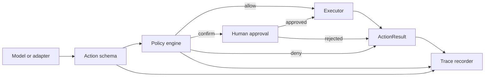

# Architecture

ActionAnything separates probabilistic model output from deterministic action
execution. A model or adapter proposes an `Action`; the runtime is responsible
for deciding whether that action is allowed to reach an executor.

## Design principles

### Model agnostic

Providers should be implemented as adapters that produce the normalized action
schema. The policy and executor layers must not depend on a provider SDK.

### Safe by construction

Safety checks live in regular Python code, not only in a prompt. A model can
request an action, but it cannot override a deny decision or approve itself.

### Dry-run first

The CLI uses `DryRunExecutor` unless a user explicitly passes `--execute`.
This makes plans inspectable before they touch a browser.

### Append-only evidence

Every evaluated action can be written to JSONL. Each event includes the action,
policy outcome, and normalized result. Sensitive parameters are redacted unless
the user explicitly opts into an unsafe local test trace.

## Core modules

| Module | Responsibility |
|---|---|
| `actions.py` | Stable action, risk, and result schemas |
| `policy.py` | Composable allow, confirm, and deny decisions |
| `executors.py` | Dry-run and optional Playwright execution |
| `runtime.py` | Policy-to-confirmation-to-execution orchestration |
| `recorder.py` | Redacted JSONL traces and trace loading |
| `cli.py` | Portable plans, trace inspection, and replay |

## Extending the project

### Add a model adapter

Translate a provider response into `Action.from_dict(...)`. Keep authentication,
streaming, and provider-specific fields in the adapter package; store useful
provenance under `Action.metadata`.

### Add an executor

Implement `Executor.execute(action)` and expose `is_dry_run`. Executors should
reject unsupported actions, avoid hidden retries, and return JSON-compatible
metadata rather than provider objects.

### Add a policy

Implement `Policy.evaluate(action)`. Return `None` when the policy does not
apply. `PolicyEngine` gives deny decisions precedence over confirmation, and
confirmation precedence over allow.

## Near-term roadmap

- Provider adapters for common computer-use model outputs.
- JSON Schema export for actions and policy outcomes.
- Screenshot evidence associated with each trace step.
- Sandboxed remote executors and explicit resource limits.
- BrowserGym/WebArena-compatible evaluation runners.
- Signed policy bundles for shared deployments.

